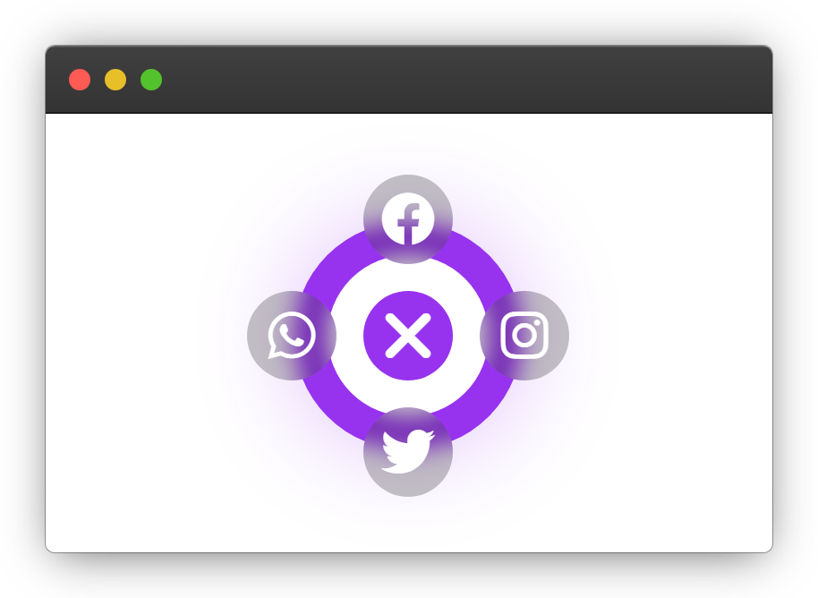

## Project title

**_Circular Share Button_**

## project description

This project is a share button made with HTML, CSS, and JS that provides multiple options for sharing. The button allows users to share content on various social media platforms such as Facebook, Twitter, and among others.

### Features

- The button has an animation effect that makes it more appealing to users.
- Incorporating a sound effect into the button enhances its attractiveness and engages users
- The button provides different options for sharing, including Facebook, Twitter, LinkedIn among others.

## 🔗 Links

#### Creator

#### Contributor

### Output

